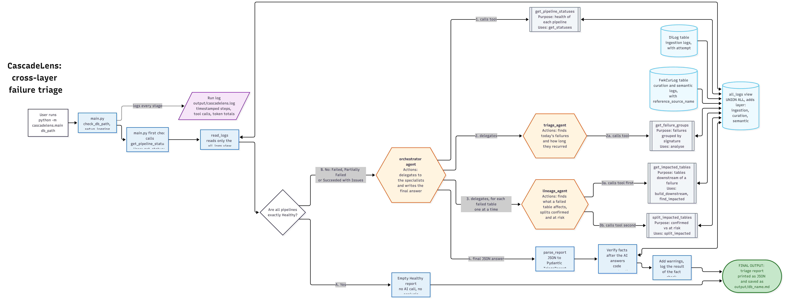
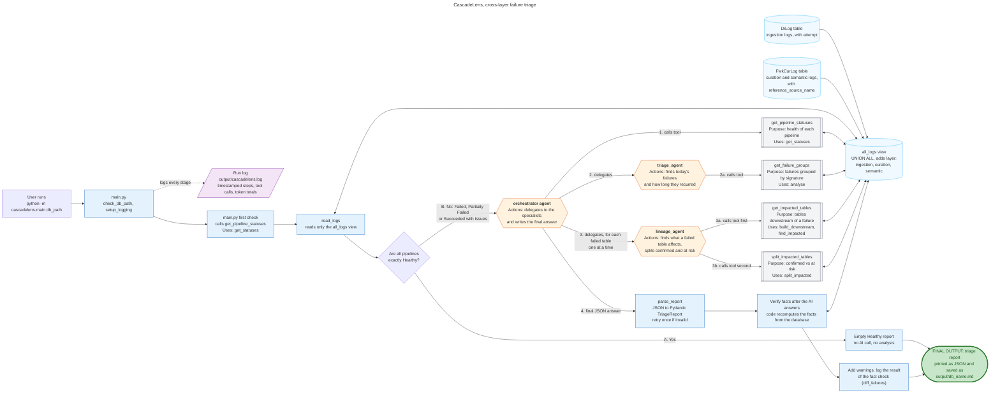

# CascadeLens: cross-layer failure triage

Architecture diagram. Blue boxes are plain Python, which computes the facts. Orange hexagons are AI agents (gpt-4o-mini). Grey boxes are the tools the agents call. Green is the final output.

## Explanation of the diagram

**Data**
- `DiLog` holds ingestion logs. `FwkCurLog` holds curation and semantic logs.
- The `all_logs` view joins them and adds a `layer` value (ingestion, curation or semantic). The code reads only this view.

**Before any AI (blue boxes)**
- `main.py` checks the database path and sets up logging to `output/cascadelens.log`.
- `get_statuses` reads the logs and works out the health of each pipeline.
- Branch A: if every pipeline is exactly Healthy, the program prints an empty Healthy report. No AI call is made.
- Branch B: if any pipeline is Failed, Partially Failed or Succeeded with Issues, the orchestrator agent starts.

**The AI agents (orange hexagons)**
- Step 1: the orchestrator calls `get_pipeline_statuses`.
- Step 2: it delegates to `triage_agent`, which calls `get_failure_groups` (2a) to find today's failures and how long each has recurred.
- Step 3: for each failed table, one at a time, it delegates to `lineage_agent`, which calls `get_impacted_tables` (3a) and then `split_impacted_tables` (3b). The result is the confirmed impacted tables and the at risk tables.
- Step 4: the orchestrator writes the final JSON answer, including a plain-English root cause for each failure.
- Every agent returns its answer to whoever called it. Each tool runs plain Python and reads the database.

**After the AI answers (blue boxes)**
- `parse_report` turns the JSON into a Pydantic `TriageReport`. If the answer is invalid, it retries once.
- Code verifies the facts: it recomputes them from the database and logs whether the agent's facts match (`diff_failures`). The check only logs. It never changes the agent's answer.
- Code adds the empty-load warnings to the report.

**Output (green)**
- The triage report is printed as JSON and saved as `output/<db name>.md`.

## Where AI is used

- Only the three orange agents use the model. Code decides the facts. The AI chooses which tools to call and writes the root cause wording.